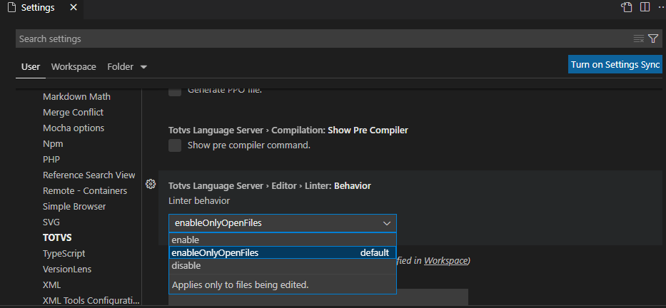

# TDS: Linter

> Requisitos
>
> - projeto aberto
> - diretório de includes configurado

O _Linter_ é um analisador de código estático que aponta erros de programação em seu código durante a edição ou em segundo plano. Ele apresenta os problemas encontrados no próprio editor e também na visão de _Problemas_.

Este recurso ajudará o desenvolvedor a identificar problemas antes de efetuar a compilação no _AppServer_, auxiliando-o a eliminar avisos (_warnings_), pois estes já serão identificados mesmo antes de sua compilação.

## Comportamento do _linter_

Para alterar o comportamento do _linter_, acesse as configurações da extensões ([Settings](https://code.visualstudio.com/docs/getstarted/settings)), acessando na árvore da visão _settings_, ``extensions + TOTVS``.

Onde:

- ``enable``: habilita o processo em todos os fontes da área de trabalho.
- ``enableOnlyOpenFiles``: habilita o processo somente nos arquivos em edição (padrão) e mantem o comportamento como nas versões anteriores.
- ``disable``: desabilita o processo.

## Includes

Como em qualquer compilação de um fonte AdvPL é necessário que o diretório de _Includes_ esteja configurado corretamente para que o processo funcione corretamente.

Caso ocorra o erro ``C2090  File not found PRTOPDEF.CH``, é provável que o diretório de _Includes_ não esteja configurado corretamente. Revise as configurações conforme indicado em [Configuração de Include](compilation.md#configura%C3%A7%C3%A3o-de-include-busca-de-arquivos-de-defini%C3%A7%C3%A3o).

> **Arquivos 4GL e PER (Logix):**
>
> Para a correta análise desses arquivos o _Linter_ necessita do arquivo ``.SCH`` (_Scheme_ do banco de dados, normalmente ``logix.sch``). A busca por esse(s) arquivo(s) é feita na(s) pasta(s) de include configurada(s).

## Marcações

As marcações de problemas serão apresentadas no próprio Editor e também na visão de Problemas em tempo de edição.

Se for encontrado um erro crítico no código ele será destacado com a cor vermelha (padrão) no Editor e não indicará mais nenhum outro erro até que este seja sanado.

Caso contrário, se não houve erro crítico, ele apresentará avisos (_warnings_) se existirem e recomenda-se que os mesmos sejam sanados.

## Compilação

Com o Linter teremos as mesmas questões que seriam detectadas somente após a compilação do fonte, então se houver uma indicação de erro e/ou warning eles serão os mesmos quando o fonte for compilado.

Se perceberem algum comportamento estranho no _Linter_ realize a compilação do fonte. Caso o comportamento persista na compilação, favor abrir um [chamado diretamente na TOTVS](https://totvscst.zendesk.com/hc/pt-br/#home) informando o problema encontrado na compilação para que o time do _AppServer_ possa avaliar a questão. Quando o problema for solucionado pelo time de _AppServer_ o _Linter_ receberá a correção nas próximas atualizações da extensão.

## Ignorar pastas e arquivos